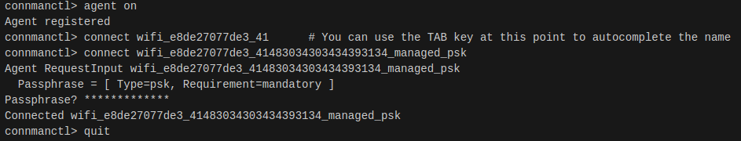
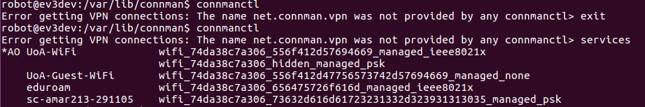

# Wireless Setup

## Before you start:
1. It is assumed your computer has a Linux OS with WiFi capabilities. You would also need to be able to connect to a WiFi network that you and the robot can share.
Note: It is **much better** to use dualboot since there are no added complexity, but using VirtualBox will also works with the right setup.
2. Check if you are able to SSH to the robot via USB.
3. Ensure that your robot has a compatible WiFi dongle. For more information, check [here](https://github.com/ev3dev/ev3dev/wiki/USB-Wi-Fi-Dongles)

## How to enable wireless tethering
1. Connect the computer to the robot via USB cable
2. SSH to the robot in terminal. This can be done by opening a new terminal and executing **ssh robot<i></i>@ev3dev.local**. The default password is **maker**.
3. Open ConnMan with the command **connmanctl**. Ignore the error **Error getting VPN connections:...**.
4. Enable WiFi by executing **enable wifi** in the ConnMan interface.
5. Scan WiFi by executing **scan wifi** in the ConnMan interface.
6. Execute **services**. This will print out a list of available networks ConnMan has detected from the robot.
7. Execute **agent on**.

The following shows an example of what you would see up to this point.

(Sourced from http://www.ev3dev.org/docs/tutorials/setting-up-wifi-using-the-command-line/)

8. Note the different types of connections and security protocols. Find the network which you want to connect to.
9. If your network's security is **managed_psk**, then you can connect to the network by following the commands below:

(Sourced from http://www.ev3dev.org/docs/tutorials/setting-up-wifi-using-the-command-line/)

After you have done this, skip to step 16.

10. However, if your network's security is **managed_ieee8021x** (as shown below for UoA-WiFi"), you would be unable to connect to the network using the above method. Instead, you would need a custom .config file on the robot.

    
11. Quit the ConnMan interface with the **quit** command, then execute **cd /var/lib/connman** to navigate to the ConnMan folder.
12. We want to make a .config file in the ConnMan folder. It is recommended to call the file the name of the network you want to connect to. For example, a UoA-WiFi.config file would be created to connect to the UoA-WiFi network.
13. Edit the file using an inbuilt text editor like nano or vim. We want to follow a format specified [here](http://www.erdahl.io/2016/05/connecting-to-ieee8021x-network-with.html). An example I used for UoA-WiFi.config is:

[service_UoA-WiFi]\
Type=wifiName=UoA-WiFi\
EAP=peap\
Phase2=MSCHAPV2\
Identity=**Your UPI here (abcd123)**\
Passphrase=**Your password**

Check that your spelling is correct!

14. Save the file and reboot the robot.
15. Follow steps 3-8 again. Provided your credentials are correct, you should be able to connect to the ieee8021x network without having to enter a password.

16. Once you have quit the ConnMan interface, quit the SSH with **exit**, disconnect the cable and reboot the robot. Provided your computer is connected to the same WiFi network as the robot, you should be able to SSH to the robot without the USB cable.

Note: If your robot detects the network , but is unable to connect to it, changing the network connection default to Linux default settings may help. This can be done by navigating on the robot:
**Wireless and Networks** > **Wi-Fi** > _**Your chosen network**_ > **Network Connections** > **IPv4** > **Change...** and select **Load Linux defaults**.

Note: If you are unable to ssh to the robot in the future, it may be that the IP address of the robot has changed.
You can find the IP address of the robot on the brick's screen at the top left hand corner. From there, you can ssh to the robot by either:
* Executing **ssh robot@*robot's IP address* ** (e.g. ssh robot@123.45.67.234), or
* Adding/editing an entry for ev3dev.local in the /etc/hosts file with the new IP address

